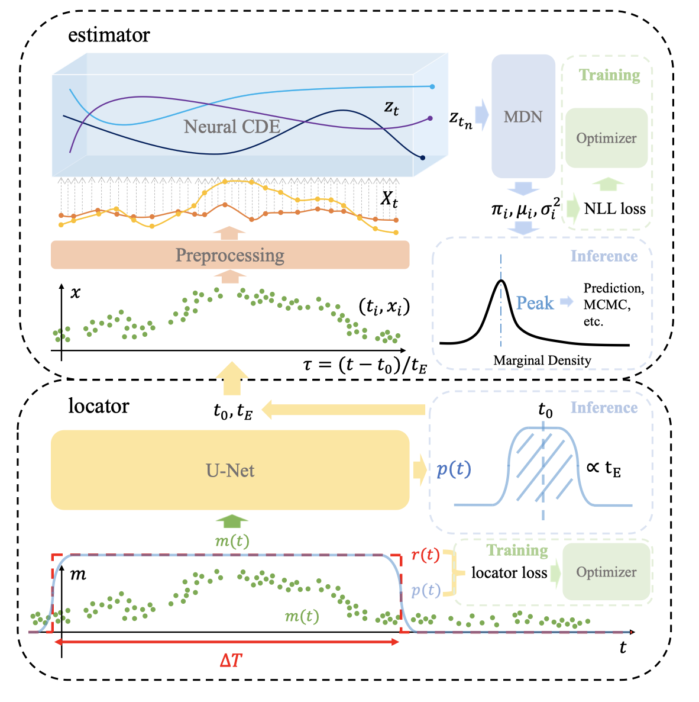

# MAGIC: Microlensing Analysis Guided by Intelligent Computation

This repo contains the code for the paper 

*MAGIC: Microlensing Analysis Guided by Intelligent Computation* 

and the extended abstract 

*Parameter Estimation in Realistic Binary Microlensing Light Curves with Neural Controlled Differential Equation*.

# Abstract

The modeling of binary microlensing light curves via the standard sampling-based method can be challenging, because of the time-consuming light curve computation and the pathological likelihood landscape in the high-dimensional parameter space. In this work, we present MAGIC, which is a machine learning framework to efficiently and accurately infer the microlensing parameters of binary events with realistic data quality. In MAGIC, binary microlensing parameters are divided into two groups and inferred separately with different neural networks. The key feature of MAGIC is the introduction of neural controlled differential equation, which provides the capability to handle light curves with irregular sampling and large data gaps. Based on simulated light curves, we show that MAGIC can achieve fractional uncertainties of a few percent on the binary mass ratio and separation. We also test MAGIC on a real microlensing event. MAGIC is able to locate the degenerate solutions even when large data gaps are introduced. As irregular samplings are common in astronomical surveys, our method also has implications to other studies that involve time series.

# Checkpoints
Checkpoints of pretrained models can be downloaded at [this url](https://cloud.tsinghua.edu.cn/d/c81144404fbe4f0f89cd/).

This includes locator with $k=1/3, 0.75, 1, 1.25, 1.5, 1.75, 2$ and estimator with latent dim 32, nG=12 and diagonal covariance used in the paper.

# Experiments
Experiments and tests in the paper can be reproduced with the Jupyter notebooks in [the `test` folder](./test/). This folder also contains additional tests not shown in the paper, which might be useful reference for other uses.